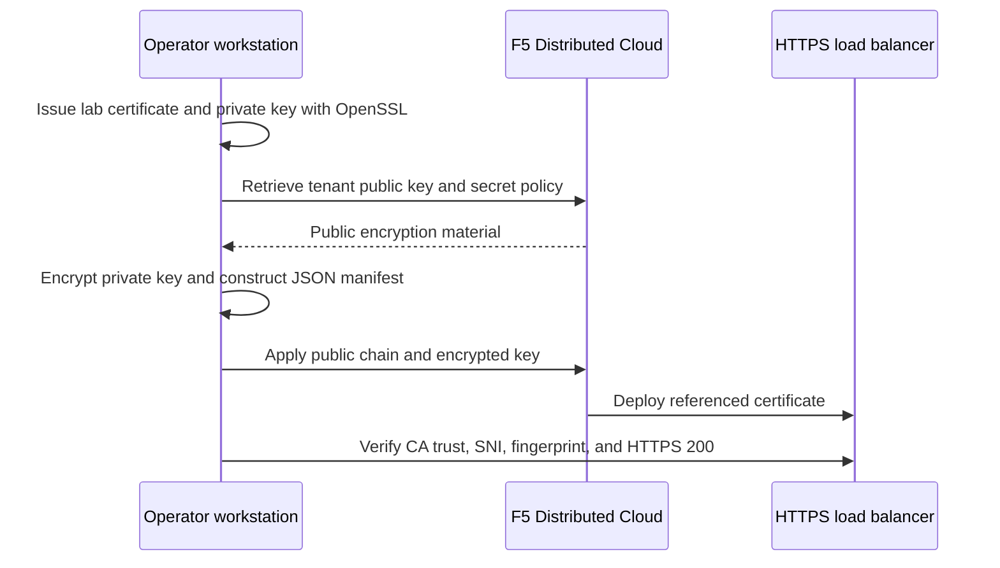

Use xcsh to encrypt a Transport Layer Security (TLS) private key before you send it to F5 Distributed Cloud. In this walkthrough, you create a private lab certificate authority (CA), deploy an encrypted certificate to a temporary HTTPS load balancer, rotate the certificate, and remove the resources.

OpenSSL issues the lab certificates. xcsh retrieves your tenant's public encryption material, encrypts the private key locally, and manages the F5 resources. Blindfold does not issue certificates or renew them automatically. For an existing certificate, start with its matching private key and a certificate chain ordered from the server certificate to its issuers.



The private CA is only for this lab. Trust it explicitly during verification; do not add it to your system trust store. The fixed response demonstrates certificate deployment without an origin server.

## Prerequisites

- macOS or Linux with Bash, Python 3, jq, cURL, and OpenSSL 3 on `PATH`. On macOS, use Homebrew OpenSSL rather than an older system implementation.
- [Immutable xcsh v23.0.1](https://github.com/f5-sales-demo/xcsh/releases/tag/v23.0.1). The examples require its certificate comparison fix; check the command help before using another version.
- An authenticated, saved global xcsh context for your authorized lab tenant. Follow [context setup](https://f5-sales-demo.github.io/xcsh/en/f5-distributed-cloud/contexts-namespaces/).
- An existing approved lab namespace and permission to retrieve the tenant public key and `shared/ves-io-allow-volterra` policy, and to create, read, update, and delete certificates and HTTPS load balancers.
- Outbound access to the tenant API and the load balancer's public virtual IP (VIP) on port 443. A proxy must not intercept the lab TLS connection.

Run the walkthrough in one Bash session. Replace `<SAVED_CONTEXT_NAME>` and `<APPROVED_LAB_NAMESPACE>` with your approved values. The generated hostname is under the reserved `example.test` domain; `--resolve` directs verification to your allocated VIP without publishing a DNS record.

## Walkthrough

### Prepare a private working directory

1. Create a new directory outside any Git checkout, set owner-only permissions, and choose unique resource names.

   ```bash
   set -euo pipefail
   umask 077
   export XCSH_SAVED_CONTEXT='<SAVED_CONTEXT_NAME>'
   export XCSH_NAMESPACE='<APPROVED_LAB_NAMESPACE>'
   XCSH_WORKDIR="$(mktemp -d "${TMPDIR:-/tmp}/xcsh-certificate.XXXXXXXX")"
   export XCSH_WORKDIR
   cd "$XCSH_WORKDIR"
   export XCSH_RUN_ID="$(openssl rand -hex 6)"
   export XCSH_CERT_NAME="xcsh-tls-$XCSH_RUN_ID"
   export XCSH_LB_NAME="xcsh-https-$XCSH_RUN_ID"
   export XCSH_DOMAINNAME="$XCSH_LB_NAME.example.test"
   ```

2. Link the saved context into this directory. Remove inherited API overrides first so retrieval uses the intended context. Export a private credential snapshot for the generic resource commands in the same session.

   ```bash
   unset XCSH_API_URL XCSH_API_TOKEN XCSH_CONTEXT_NAME
   xcsh context link certificate-lab "$XCSH_SAVED_CONTEXT" \
     --source local --json > context-link.json 2> context-link.err
   xcsh context export "$XCSH_SAVED_CONTEXT" --include-token \
     > context-private.json 2> context-export.err
   jq -e '.contexts | length == 1' context-private.json > /dev/null
   export XCSH_API_URL="$(jq -er '.contexts[0].apiUrl' context-private.json)"
   export XCSH_API_TOKEN="$(jq -er '.contexts[0].apiToken' context-private.json)"
   export XCSH_CONTEXT_NAME=certificate-lab
   ```

   The snapshot contains a credential. Keep it, the shell environment, and all generated artifacts private. Do not enable shell tracing. `--context-name` on Blindfold commands asserts the context; it does not switch contexts. The generic `apply`, `get`, and `delete` commands use the exported API credentials and explicit namespace.

### Generate a lab certificate

1. Generate an RSA-2048 CA key and a CA certificate valid for two days. Allow the CA to sign certificates and certificate revocation lists.

   ```bash
   openssl req -x509 -newkey rsa:2048 -nodes \
     -keyout ca-key.pem -out ca.pem -days 2 \
     -subj '/CN=Example lab CA' \
     -addext 'basicConstraints=critical,CA:true' \
     -addext 'keyUsage=critical,keyCertSign,cRLSign' \
     -addext 'subjectKeyIdentifier=hash' \
     > ca-create.out 2> ca-create.err
   ```

2. Define the server certificate extensions, including server authentication and a DNS subject alternative name (SAN).

   ```bash
   python3 - <<'PY'
   import os
   from pathlib import Path

   Path('server.ext').write_text(
       'basicConstraints=critical,CA:false\n'
       'keyUsage=critical,digitalSignature,keyEncipherment\n'
       'extendedKeyUsage=serverAuth\n'
       'subjectAltName=DNS:' + os.environ['XCSH_DOMAINNAME'] + '\n'
   )
   PY
   ```

3. Generate the first server key and signing request, issue a certificate valid for one day, and build a leaf-first chain.

   ```bash
   openssl req -new -newkey rsa:2048 -nodes \
     -keyout server1-key.pem -out server1.csr \
     -subj "/CN=$XCSH_DOMAINNAME" > server1-create.out 2> server1-create.err
   openssl x509 -req -in server1.csr -CA ca.pem -CAkey ca-key.pem \
     -CAcreateserial -days 1 -sha256 -extfile server.ext \
     -out server1.pem > server1-sign.out 2> server1-sign.err
   cat server1.pem ca.pem > chain1.pem
   openssl verify -CAfile ca.pem -purpose sslserver \
     -verify_hostname "$XCSH_DOMAINNAME" server1.pem > server1-verify.out
   ```

   The verification file reports `server1.pem: OK`. `chain1.pem` contains the server certificate followed by the CA certificate. The private CA signing key stays local.

### Retrieve public material and encrypt the key

1. Retrieve the tenant public key and platform TLS secret policy using canonical commands.

   ```bash
   xcsh blindfold public-key --context-name certificate-lab \
     --output-file tenant-public-key.json > public-key-report.json 2> public-key.err
   xcsh blindfold policy --context-name certificate-lab \
     --policy shared/ves-io-allow-volterra \
     --output-file policy.json > policy-report.json 2> policy.err
   ```

   These files default to snake_case JSON. They contain public encryption material and tenant identity, so keep them private. Both documents must identify the same canonical tenant.

2. Encrypt the unprotected server PEM key offline with the paired documents. Store a textual location in a new owner-only file.

   ```bash
   xcsh blindfold encrypt --input server1-key.pem \
     --public-key tenant-public-key.json --policy-document policy.json \
     --encoding location --output-file key1.location \
     > encrypt1-report.json 2> encrypt1.err
   jq -e '.status == "prepared"' encrypt1-report.json > /dev/null
   ```

   `key1.location` contains `string:///` followed by the base64 envelope. Use that location unchanged. Paired documents make this operation offline; omit `--context-name`. The encrypted key remains a sensitive artifact even though it is ciphertext.

### Construct and apply the certificate manifest

1. Create a reusable local serializer. It base64-encodes the public PEM chain and validates that the encrypted location has exactly one prefix.

   ```bash
   cat > make-certificate.py <<'PY'
   import base64
   import json
   import os
   import sys
   from pathlib import Path

   chain_file, location_file, destination = sys.argv[1:]
   XCSH_NAMESPACE = os.environ['XCSH_NAMESPACE']
   location = Path(location_file).read_text().strip()
   prefix = 'string:///'
   if not location.startswith(prefix):
       raise SystemExit('Expected a Blindfold location')
   base64.b64decode(location[len(prefix):], validate=True)
   manifest = {
       'kind': 'certificate',
       'metadata': {
           'name': os.environ['XCSH_CERT_NAME'],
           'namespace': XCSH_NAMESPACE,
           'labels': {'example-lab': os.environ['XCSH_RUN_ID']},
       },
       'spec': {
           'certificate_url': prefix + base64.b64encode(
               Path(chain_file).read_bytes()).decode('ascii'),
           'private_key': {'blindfold_secret_info': {'location': location}},
       },
   }
   with Path(destination).open('x') as output:
       json.dump(manifest, output, indent=2)
       output.write('\n')
   PY
   python3 make-certificate.py chain1.pem key1.location certificate1.json
   ```

   | Field | Purpose |
   | --- | --- |
   | `kind` | Selects the xcsh `certificate` resource kind. |
   | `metadata.name`, `metadata.namespace` | Identify the resource you own in the approved namespace. |
   | `metadata.labels` | Mark this run's temporary resource. |
   | `spec.certificate_url` | Contains `string:///` plus base64 of the public leaf-first chain. Base64 is an encoding, not encryption. |
   | `spec.private_key.blindfold_secret_info.location` | Contains the already encrypted location from `key1.location`, unchanged. |

2. Validate locally, calculate a client dry run, and apply the saved manifest. Capture complete reports privately.

   ```bash
   jq -e . certificate1.json > /dev/null
   xcsh validate -f certificate1.json -n "$XCSH_NAMESPACE" -o json \
     > certificate1-validation.json 2> certificate1-validation.err
   xcsh apply -f certificate1.json -n "$XCSH_NAMESPACE" --dry-run client -o json \
     > certificate1-preview.json 2> certificate1-preview.err
   xcsh apply -f certificate1.json -n "$XCSH_NAMESPACE" -o json \
     > certificate1-apply.json 2> certificate1-apply.err
   jq -e '.success and .results[0].status == "created"' \
     certificate1-apply.json > /dev/null
   jq '{success, statuses: [.results[].status]}' certificate1-apply.json
   ```

   Expected sanitized output:

   ```json
   {
     "success": true,
     "statuses": [
       "created"
     ]
   }
   ```

   JSON parsing checks syntax; `xcsh validate` checks the resource schema. Neither validates the private key against the certificate in this manually assembled manifest. The native `blindfold certificate` alternative below performs those cryptographic checks. Client dry run inspects the target and calculates changes without writing to the tenant.

3. Apply the identical saved manifest again and verify that xcsh preserves it.

   ```bash
   xcsh apply -f certificate1.json -n "$XCSH_NAMESPACE" -o json \
     > certificate1-reapply.json 2> certificate1-reapply.err
   jq -e '.success and .results[0].status == "unchanged"' \
     certificate1-reapply.json > /dev/null
   jq '{success, statuses: [.results[].status]}' certificate1-reapply.json
   ```

   Expected status: `unchanged`. Blindfold encryption uses fresh randomness each time. Re-encrypting the same key produces different ciphertext and therefore a new manifest; reuse the saved manifest when you want an unchanged apply.

### Deploy an HTTPS load balancer

1. Construct a fixed-response load balancer that references your certificate. This lab enables no application security controls and has no origin pool; it returns a fixed public test message.

   ```bash
   python3 - <<'PY'
   import json
   import os
   from pathlib import Path

   XCSH_NAMESPACE = os.environ['XCSH_NAMESPACE']
   manifest = {
       'kind': 'http_loadbalancer',
       'metadata': {
           'name': os.environ['XCSH_LB_NAME'],
           'namespace': XCSH_NAMESPACE,
           'labels': {'example-lab': os.environ['XCSH_RUN_ID']},
       },
       'spec': {
           'domains': [os.environ['XCSH_DOMAINNAME']],
           'https': {
               'port': 443,
               'tls_cert_params': {
                   'certificates': [{
                       'name': os.environ['XCSH_CERT_NAME'],
                       'namespace': XCSH_NAMESPACE,
                   }],
                   'no_mtls': {},
                   'tls_config': {'default_security': {}},
               },
               'http_redirect': False,
               'enable_path_normalize': {},
           },
           'advertise_on_public_default_vip': {},
           'routes': [{'direct_response_route': {
               'http_method': 'ANY',
               'path': {'prefix': '/'},
               'route_direct_response': {
                   'response_code': 200,
                   'response_body': 'Example certificate lab\n',
               },
           }}],
           'default_route_pools': [],
           'origin_pools': [],
           'disable_waf': {},
           'no_service_policies': {},
           'disable_api_definition': {},
           'disable_api_discovery': {},
           'disable_bot_defense': {},
           'disable_rate_limit': {},
           'disable_ip_reputation': {},
           'disable_malicious_user_detection': {},
       },
   }
   with Path('load-balancer.json').open('x') as output:
       json.dump(manifest, output, indent=2)
       output.write('\n')
   PY
   xcsh validate -f load-balancer.json -n "$XCSH_NAMESPACE" -o json \
     > lb-validation.json 2> lb-validation.err
   xcsh apply -f load-balancer.json -n "$XCSH_NAMESPACE" --dry-run client -o json \
     > lb-preview.json 2> lb-preview.err
   xcsh apply -f load-balancer.json -n "$XCSH_NAMESPACE" -o json \
     > lb-apply.json 2> lb-apply.err
   jq -e '.success and .results[0].status == "created"' lb-apply.json > /dev/null
   ```

2. Create a verification script that waits up to five minutes for readiness and checks the actual endpoint. It uses the allocated VIP, the intended Server Name Indication (SNI), private CA trust, the served SHA-256 fingerprint, and HTTP 200.

   ```bash
   cat > verify-https.py <<'PY'
   import hashlib
   import json
   import os
   import socket
   import ssl
   import subprocess
   import sys
   import time
   from pathlib import Path

   leaf, report_name = sys.argv[1:]
   expected = hashlib.sha256(subprocess.check_output(
       ['openssl', 'x509', '-in', leaf, '-outform', 'DER'])).hexdigest()
   trust = ssl.create_default_context(cafile='ca.pem')
   domain = os.environ['XCSH_DOMAINNAME']
   deadline = time.monotonic() + 300
   while time.monotonic() < deadline:
       with open('lb-readback.json', 'wb') as out, open('lb-readback.err', 'wb') as err:
           read = subprocess.run([
               'xcsh', 'get', 'http_loadbalancer', os.environ['XCSH_LB_NAME'],
               '-n', os.environ['XCSH_NAMESPACE'], '-o', 'json',
           ], stdout=out, stderr=err, timeout=40, check=False)
       if read.returncode:
           raise SystemExit('Named load balancer read failed; inspect private report')
       spec = json.loads(Path('lb-readback.json').read_text())['results'][0]['resource']['spec']
       if (spec.get('state') != 'VIRTUAL_HOST_READY'
               or spec.get('cert_state') != 'CertificateValid'):
           time.sleep(3)
           continue
       for entry in spec.get('dns_info', []):
           vip = entry.get('ip_address')
           if not vip:
               continue
           try:
               with socket.create_connection((vip, 443), timeout=5) as raw:
                   with trust.wrap_socket(raw, server_hostname=domain) as tls:
                       actual = hashlib.sha256(tls.getpeercert(binary_form=True)).hexdigest()
               if actual != expected:
                   continue
               with open('https.err', 'wb') as err:
                   response = subprocess.run([
                       'curl', '--silent', '--show-error', '--fail', '--noproxy', '*',
                       '--connect-timeout', '5', '--max-time', '10', '--cacert', 'ca.pem',
                       '--resolve', domain + ':443:' + vip, 'https://' + domain + '/',
                       '--output', 'https-body.txt', '--write-out', '%{http_code}',
                   ], stdout=subprocess.PIPE, stderr=err, check=False)
               if (response.returncode or response.stdout != b'200'
                       or Path('https-body.txt').read_text() != 'Example certificate lab\n'):
                   continue
               summary = {
                   'ready': True, 'certificate_valid': True, 'ca_trust': True,
                   'sni': True, 'fingerprint_match': True, 'https': 200,
                   'fingerprint': actual,
               }
               Path(report_name).write_text(json.dumps(summary, indent=2) + '\n')
               print(json.dumps({k: v for k, v in summary.items() if k != 'fingerprint'}))
               raise SystemExit(0)
           except (OSError, ssl.SSLError):
               continue
       time.sleep(3)
   raise SystemExit('HTTPS did not converge within five minutes; inspect private reports')
   PY
   python3 verify-https.py server1.pem tls1-summary.json
   ```

   Expected summary: every check is `true`, with `"https": 200`. An API-created certificate does not prove TLS readiness. Never bypass verification with `curl -k` or an unverified TLS context.

### Rotate the certificate

1. Generate a new RSA key and a second one-day certificate for the same hostname. Encrypt the new key and construct a separate rotation manifest.

   ```bash
   openssl req -new -newkey rsa:2048 -nodes \
     -keyout server2-key.pem -out server2.csr \
     -subj "/CN=$XCSH_DOMAINNAME" > server2-create.out 2> server2-create.err
   openssl x509 -req -in server2.csr -CA ca.pem -CAkey ca-key.pem \
     -CAserial ca.srl -days 1 -sha256 -extfile server.ext \
     -out server2.pem > server2-sign.out 2> server2-sign.err
   cat server2.pem ca.pem > chain2.pem
   openssl verify -CAfile ca.pem -purpose sslserver \
     -verify_hostname "$XCSH_DOMAINNAME" server2.pem > server2-verify.out
   xcsh blindfold encrypt --input server2-key.pem \
     --public-key tenant-public-key.json --policy-document policy.json \
     --encoding location --output-file key2.location \
     > encrypt2-report.json 2> encrypt2.err
   python3 make-certificate.py chain2.pem key2.location certificate2.json
   xcsh validate -f certificate2.json -n "$XCSH_NAMESPACE" -o json \
     > certificate2-validation.json 2> certificate2-validation.err
   xcsh apply -f certificate2.json -n "$XCSH_NAMESPACE" --dry-run client -o json \
     > certificate2-preview.json 2> certificate2-preview.err
   xcsh apply -f certificate2.json -n "$XCSH_NAMESPACE" -o json \
     > certificate2-apply.json 2> certificate2-apply.err
   jq -e '.success and .results[0].status == "updated"' \
     certificate2-apply.json > /dev/null
   ```

   The existing load balancer still references the same certificate name. F5 rejects a public-key algorithm change while another resource uses the certificate. Rotate RSA to RSA or elliptic curve (EC) to EC. To change algorithms, create another certificate resource, change the load balancer's reference, and verify it before removing the old resource.

2. Verify propagation, continued HTTPS 200, and a changed served fingerprint.

   ```bash
   python3 verify-https.py server2.pem tls2-summary.json
   jq -e -s '.[0].fingerprint != .[1].fingerprint and
     .[0].https == 200 and .[1].https == 200' \
     tls1-summary.json tls2-summary.json > /dev/null
   printf '%s\n' 'Rotation verified: fingerprint changed; HTTPS 200'
   ```

   This checks the endpoint after rotation. It does not measure uninterrupted service throughout the propagation interval.

### Clean up the lab

1. Delete the load balancer before the certificate it references.

   ```bash
   xcsh delete http_loadbalancer "$XCSH_LB_NAME" -n "$XCSH_NAMESPACE" -o json \
     > lb-delete.json 2> lb-delete.err
   xcsh delete certificate "$XCSH_CERT_NAME" -n "$XCSH_NAMESPACE" -o json \
     > certificate-delete.json 2> certificate-delete.err
   ```

2. Verify both exact names are absent. Only a named `not_found` result confirms absence; authentication and network failures do not.

   ```bash
   python3 - <<'PY'
   import json
   import os
   import subprocess
   import time
   from pathlib import Path

   for kind, name in [('http_loadbalancer', os.environ['XCSH_LB_NAME']),
                      ('certificate', os.environ['XCSH_CERT_NAME'])]:
       deadline = time.monotonic() + 120
       while True:
           with open(kind + '-absence.json', 'wb') as out, open(kind + '-absence.err', 'wb') as err:
               result = subprocess.run([
                   'xcsh', 'get', kind, name, '-n', os.environ['XCSH_NAMESPACE'], '-o', 'json',
               ], stdout=out, stderr=err, timeout=40, check=False)
           report = json.loads(Path(kind + '-absence.json').read_text())
           error = report['results'][0].get('error', {})
           if result.returncode and error.get('kind') == 'not_found':
               break
           if error or time.monotonic() >= deadline:
               raise SystemExit('Named absence not verified; inspect private report')
           time.sleep(3)
   print('Cleanup verified: both named resources absent')
   PY
   ```

3. Finish any input-variant or assistant exercises below while the private files remain available. Then unlink the directory's context, clear credentials and passphrases from the shell, and remove the exact temporary directory.

   ```bash
   xcsh context unlink certificate-lab --source local --json \
     > context-unlink.json 2> context-unlink.err
   unset XCSH_API_TOKEN XCSH_API_URL XCSH_CONTEXT_NAME TLS_INPUT_PASSWORD
   cd /
   test -n "$XCSH_WORKDIR"
   rm -rf -- "$XCSH_WORKDIR"
   unset XCSH_WORKDIR XCSH_RUN_ID XCSH_CERT_NAME XCSH_LB_NAME
   unset XCSH_DOMAINNAME XCSH_NAMESPACE XCSH_SAVED_CONTEXT
   ```

   Directory deletion is not a guarantee of secure erasure on flash storage or backups. Follow your team's private-artifact retention policy. If a step fails, use the recorded names and private reports to finish teardown before removing the directory.

## Input variants

These examples depend on the walkthrough's private directory, exported context, and generated files. Run them before the final local deletion, using new output paths for each invocation.

### Prepare a manifest with native certificate validation

`blindfold certificate` checks that the key matches the leaf certificate, validates the chain's order, signatures, and validity dates, and encrypts the normalized private key. It produces a manifest without deploying a resource.

```bash
xcsh blindfold certificate --context-name certificate-lab \
  --cert chain1.pem --key server1-key.pem --name "$XCSH_CERT_NAME" \
  -n "$XCSH_NAMESPACE" --output-file native-certificate.json \
  --result-file native-prepared.json > native-report.json 2> native.err
```

The default policy is `shared/ves-io-allow-volterra`. Native certificate preparation retrieves public material online; paired offline documents are supported only by raw `encrypt`.

### Use a protected PEM key

Read the passphrase through protected shell input or your secret manager. Pass its environment-variable name, never its literal value, to xcsh. Run these commands in Bash without tracing.

```bash
read -r -s -p 'Input key passphrase: ' TLS_INPUT_PASSWORD
printf '\n'
export TLS_INPUT_PASSWORD
openssl pkey -in server1-key.pem -aes-256-cbc \
  -passout env:TLS_INPUT_PASSWORD -out protected-key.pem \
  > protected-key.out 2> protected-key.err
xcsh blindfold certificate --context-name certificate-lab \
  --cert chain1.pem --key protected-key.pem --passphrase-env TLS_INPUT_PASSWORD \
  --name "$XCSH_CERT_NAME" -n "$XCSH_NAMESPACE" \
  --output-file protected-certificate.json > protected-report.json 2> protected.err
```

Raw `blindfold encrypt` encrypts input bytes unchanged. It does not decrypt a password-protected PEM file. Use `certificate`, `create`, or `replace` with `--passphrase-env` when the input key is protected.

### Use a single-key PKCS#12 bundle

A Public-Key Cryptography Standards #12 (PKCS#12) bundle can contain the matching key, leaf certificate, and issuing chain. Choose either `--bundle` or `--cert` with `--key`.

```bash
openssl pkcs12 -export -inkey server1-key.pem -in server1.pem -certfile ca.pem \
  -passout env:TLS_INPUT_PASSWORD -out server.p12 > bundle-create.out 2> bundle-create.err
xcsh blindfold certificate --context-name certificate-lab \
  --bundle server.p12 --passphrase-env TLS_INPUT_PASSWORD \
  --name "$XCSH_CERT_NAME" -n "$XCSH_NAMESPACE" \
  --output-file bundle-certificate.json > bundle-report.json 2> bundle.err
unset TLS_INPUT_PASSWORD
```

Bundles with more than one private key fail before deployment, including bundles whose key aliases collide. A wrong or unavailable passphrase also fails.

### Encrypt redirected stdin or paired offline documents

Canonical encryption supports one positional filename, `--input FILE`, `-` for redirected standard input (stdin), or redirected stdin with the filename omitted. Do not combine a positional filename with `--input`. Use `--` before a filename beginning with a dash.

```bash
cat server1-key.pem | xcsh blindfold encrypt \
  --public-key tenant-public-key.json --policy-document policy.json \
  --encoding location --output-file stdin.location - \
  > stdin-report.json 2> stdin.err
xcsh blindfold encrypt --public-key tenant-public-key.json \
  --policy-document policy.json --encoding base64 --output-file bare-base64.txt \
  < server1-key.pem > bare-report.json 2> bare.err
```

Binary plaintext is preserved. Interactive missing input fails immediately. Offline encryption requires both public-material files and performs no context resolution, credential lookup, or network access. Keep paired documents together and refresh them when the tenant's key or policy changes.

### Use the request-secrets command surface

These three operations share xcsh's native authentication and encryption service. Retrieval defaults to camelCase YAML; encryption defaults to bare base64.

```bash
xcsh request secrets get-public-key --context-name certificate-lab \
  --outfmt yaml --output-file public-key.yaml > compat-public-report.json 2> compat-public.err
xcsh request secrets get-policy-document --context-name certificate-lab \
  --namespace shared --name ves-io-allow-volterra --outfmt json \
  --output-file compat-policy.json > compat-policy-report.json 2> compat-policy.err
xcsh request secrets encrypt --public-key public-key.yaml \
  --policy-document compat-policy.json server1-key.pem \
  --encoding location --output-file compat.location > compat-report.json 2> compat.err
xcsh request secrets encrypt --public-key public-key.yaml \
  --policy-document compat-policy.json server1-key.pem \
  --outfile key.envelope --result-file binary-report.json > binary.out 2> binary.err
```

`key.envelope` contains raw binary envelope bytes, not a location string. Default stdout is empty for binary `--outfile`. For a bare-base64 text file, trim its trailing newline and prepend exactly one `string:///` before assigning a manifest location. Never prepend another prefix to `compat.location`.

### Create or replace with combined commands

The combined commands retrieve public material, validate certificate inputs, encrypt the key, and deploy a certificate. Use a fresh alternate name after the main lab cleanup; these examples create no load balancer.

```bash
export XCSH_NATIVE_CERT_NAME="xcsh-native-$XCSH_RUN_ID"
xcsh blindfold create --context-name certificate-lab \
  --cert chain1.pem --key server1-key.pem --name "$XCSH_NATIVE_CERT_NAME" \
  -n "$XCSH_NAMESPACE" --dry-run client --json \
  --result-file native-preview.json > native-preview.out 2> native-preview.err
xcsh blindfold create --context-name certificate-lab \
  --cert chain1.pem --key server1-key.pem --name "$XCSH_NATIVE_CERT_NAME" \
  -n "$XCSH_NAMESPACE" --json --result-file native-created.json \
  > native-created.out 2> native-created.err
xcsh blindfold replace --context-name certificate-lab \
  --cert chain2.pem --key server2-key.pem --name "$XCSH_NATIVE_CERT_NAME" \
  -n "$XCSH_NAMESPACE" --json --result-file native-replaced.json \
  > native-replaced.out 2> native-replaced.err
xcsh delete certificate "$XCSH_NATIVE_CERT_NAME" -n "$XCSH_NAMESPACE" -o json \
  > native-delete.json 2> native-delete.err
if xcsh get certificate "$XCSH_NATIVE_CERT_NAME" -n "$XCSH_NAMESPACE" -o json \
  > native-absence.json 2> native-absence.err; then
  printf '%s\n' 'Certificate still exists' >&2
  exit 1
fi
jq -e '.results[0].error.kind == "not_found"' native-absence.json > /dev/null
unset XCSH_NATIVE_CERT_NAME
```

Creation fails if the name exists. Replacement fails if it is absent and preserves writable metadata and certificate options from F5's replace form. A client dry run retrieves public material and inspects the named resource without a tenant write.

## Assistant workflow

The `xcsh_blindfold` assistant tool uses the same native service. Ask it to use file paths; do not paste keys, credentials, passphrases, tenant documents, or encrypted payloads into chat. Preparation operations require an artifact destination, and tool results contain public reports rather than ciphertext.

For example, ask the assistant to execute this tool request, replacing the reserved file paths with your private files:

```json
{
  "operation": "certificate",
  "cert": "/private/example-lab/chain1.pem",
  "key": "/private/example-lab/protected-key.pem",
  "passphraseEnv": "TLS_INPUT_PASSWORD",
  "name": "example-tls",
  "namespace": "demo-app",
  "contextName": "certificate-lab",
  "outputFile": "/private/example-lab/assistant-certificate.json",
  "resultFile": "/private/example-lab/assistant-report.json"
}
```

Set the passphrase variable in the environment that launches xcsh before starting the assistant. The tool receives only the variable name. A prepared report can include a public fingerprint, algorithm, expiry, target, and artifact paths. It omits the plaintext key, password, API token, and ciphertext. Target identity and paths can still be private.

| Operation | Required inputs and behavior |
| --- | --- |
| `public-key` | Retrieve the tenant public key; optional `outputFile` stores the document. |
| `policy` | Retrieve the policy; optional `policy` selects `namespace/name`, and `outputFile` stores the document. |
| `encrypt` | Require `input` file path and `outputFile`; optional paired `publicKey` and `policyDocument` paths select offline encryption. No assistant stdin. |
| `certificate` | Require `name`, `cert` and `key` paths or a `bundle` path, and `outputFile`; prepare a validated encrypted manifest. |
| `create` | Use the certificate inputs and `name`; deploy only when authorized, or set `dryRun` to `client`. |
| `replace` | Use the certificate inputs and existing `name`; replace only when authorized, or set `dryRun` to `client`. |

Other accepted parameters are `namespace`, `policy`, `passphraseEnv`, `contextName`, and `resultFile`. They map to their hyphenated CLI flags. The tool does not accept `keyVersion`, `encoding`, `outfile`, `outfmt`, raw inline material, or compatibility operation names.

Session file-access controls apply to input and destination paths. A context, credential, or namespace change
stops the operation; retry only after confirming the intended context. Plan Mode blocks deployments and
artifact writes, including preparation with `outputFile` and reports with `resultFile`. Retrieval without an
artifact destination can return a public report in Plan Mode; it does not expose the document in the tool
result.

After authorized deployment, verify TLS separately and remove run-owned resources as in the walkthrough. File-only assistant preparation has been exercised on installed v23.0.1 on both hosts; that evidence does not authorize future assistant deployments.

## Command reference

Use `xcsh blindfold <operation> --help` or `xcsh request secrets <operation> --help` for operation-specific flags.

### Operations and defaults

| Command | Input | Default result |
| --- | --- | --- |
| `blindfold public-key` | Online tenant context; optional `--key-version` | snake_case JSON public-key document. |
| `blindfold policy` | Online context; `--policy` or `--namespace` with `--name` | snake_case JSON policy document; default `shared/ves-io-allow-volterra`. |
| `blindfold encrypt` | File or redirected stdin; online context or paired offline documents | Textual `string:///` location; no resource write. |
| `blindfold certificate` | `--name` and `--cert` with `--key`, or `--bundle` | Validated JSON certificate manifest; no resource write. |
| `blindfold create` | Certificate inputs and an absent resource name | Named create and readback; public report. |
| `blindfold replace` | Certificate inputs and an existing resource name | Named replacement and readback; public report. |
| `request secrets get-public-key` | Online context; optional `--key-version` | camelCase YAML public-key document. |
| `request secrets get-policy-document` | Online context; required `--name`, optional `--namespace` | camelCase YAML policy document; namespace defaults to `default`. Use explicit `shared` for the platform TLS policy. |
| `request secrets encrypt` | Same raw input choices as canonical encryption | Bare-base64 text; no resource write. |

These defaults describe output without an artifact flag. With `--output-file`, the artifact stays on disk and stdout becomes a public JSON report. Redirect even public reports if target identity or paths are sensitive.

### Flags and output restrictions

| Flag | Applies to | Meaning and restrictions |
| --- | --- | --- |
| `--context-name NAME` | Online operations | Assert the current context; does not activate another context. Rejected for offline encryption. |
| `--output json\|yaml` | Public-material retrieval | Select document format; does not select ciphertext encoding. |
| `--outfmt json\|yaml` | Request-secrets commands | Select retrieval format. Accepted by compatibility encryption without changing its encoding. Conflicts with `--output`. |
| `--key-version UINT32` | Both public-key retrieval commands | Values 0–4294967295. Zero selects the server default; a positive request must return that exact version without fallback. |
| `--policy NAMESPACE/NAME` | Canonical policy, raw encryption, certificate operations | Default `shared/ves-io-allow-volterra`. On canonical policy retrieval, conflicts with explicit `--namespace` or `--name`. |
| `-n`, `--namespace` | Policy retrieval or certificate operations | Select policy namespace or certificate namespace. Certificate namespace otherwise defaults to `XCSH_NAMESPACE`. |
| `--input FILE` | Raw encryption | Alternative to one positional filename or redirected stdin. |
| `--public-key FILE`, `--policy-document FILE` | Raw encryption | Must occur together; only supported by `encrypt`; select offline processing. |
| `--cert FILE`, `--key FILE`, `--bundle FILE` | Certificate preparation/create/replace | Choose separate PEM chain/key or a single-key PKCS#12 bundle. |
| `--passphrase-env NAME` | Certificate preparation/create/replace | Name of the environment variable containing the input-key or bundle passphrase. |
| `--encoding base64\|location` | Both raw encryption commands | Explicit text encoding; canonical default is `location`, compatibility default is `base64`. |
| `--output-file FILE` | All operations | Store selected text/document/manifest atomically in a new mode-0600 file. Conflicts with `--json`. |
| `--outfile FILE` | Compatibility raw encryption only | Store raw binary envelope atomically in a new mode-0600 file. Conflicts with explicit `--encoding`, `--output-file`, and `--json`. |
| `--json` | All operations | Print the public report without artifact material. Conflicts with `--output` and `--output-file`; encryption with only `--json` does not retain ciphertext. |
| `--result-file FILE` | All operations | Store a public JSON report in a new mode-0600 file. It must differ from the artifact path; allowed with binary `--outfile`. |
| `--dry-run client` | Certificate preparation/create/replace | Validate without a tenant write. Create/replace also inspect the target. Local artifact writes are still possible outside Plan Mode. |

All Blindfold artifact and report destinations must be new files in an existing writable directory. Existing
files and symlinks are rejected; there is no overwrite flag or output-directory routing. Use distinct
filenames on retries. Generic resource `--result-file` reports have a different implementation and can contain
complete manifests, diffs, resource data, and ciphertext; the walkthrough redirects them under `umask 077`.

To select an explicit available key version from the retrieved document:

```bash
XCSH_KEY_VERSION="$(jq -er '.data.key_version' tenant-public-key.json)"
xcsh blindfold public-key --context-name certificate-lab \
  --key-version "$XCSH_KEY_VERSION" --output yaml --output-file versioned-public-key.yaml \
  > versioned-report.json 2> versioned.err
xcsh request secrets get-public-key --context-name certificate-lab \
  --key-version "$XCSH_KEY_VERSION" --outfmt json --output-file versioned-compat-key.json \
  > versioned-compat-report.json 2> versioned-compat.err
unset XCSH_KEY_VERSION
```

### Supported inputs and limits

| Input | Contract |
| --- | --- |
| Certificate keys | RSA 2048–8192 bits; EC P-256 or P-384. Unsupported types and curves fail. |
| Certificate chain | PEM, leaf first, followed by issuers with matching names and valid signatures. Every supplied certificate must be currently valid. The leaf key must match the private key. |
| Protected input | Password-protected PEM and single-private-key PKCS#12, handled by native certificate operations. |
| Public documents | One JSON or YAML document with the required public fields; known camelCase and snake_case spellings accepted, including the API `data` wrapper. Agreeing aliases accepted; conflicting aliases, duplicate keys, multiple documents, malformed fields, or mismatched tenants rejected. |
| Raw secret | Binary-safe bounded native file or redirected stdin reads. Raw encryption does not interpret certificate content. |
| File input | At most 2 MiB per native input file; encoded limits below usually impose a smaller usable secret size. |
| Encoded output | Maximum 131072 bytes for the encrypted location and separately for the encoded certificate chain. There is no CLI size-limit override. |

Native processing uses bundled OpenSSL; xcsh encryption does not invoke the OpenSSL executable. OpenSSL in this walkthrough is for issuance and independent verification. Private input buffers, normalized key PEM, and the random AES key block use zeroizing native allocations; parsed key objects are owned by OpenSSL, and the intermediate RSA plaintext integer is cleared.

### Native encryption envelope

Blindfold encrypts the secret with Advanced Encryption Standard 256-bit Galois/Counter Mode (AES-256-GCM), using a random 32-byte key, a 12-byte nonce, and a 16-byte authentication tag. A policy-derived RSA exponent wraps the random key block. For policy ID `p` and tenant exponent `e`, the effective exponent is `e * (2*p + 2^31 + 1)`.

| Envelope field | Encoding |
| --- | --- |
| Canonical tenant | Length-prefixed UTF-8. |
| Key version | Unsigned 32-bit big-endian integer. |
| Policy ID | Unsigned 64-bit big-endian integer. |
| Algorithm marker | One byte, value `2`. |
| Complete public exponent and modulus | Length-prefixed unsigned big-endian byte strings. |
| Wrapped random key block | Length-prefixed RSA modulus-width bytes. |
| Encrypted secret | AES-256-GCM ciphertext followed by its 16-byte tag. |

Lengths are unsigned 32-bit big-endian integers. The random block is two bytes shorter than the modulus width and includes the protocol marker, nonce, AES key, and random padding. GCM uses empty additional authenticated data. Text output base64-encodes the entire envelope; a location adds `string:///`. xcsh exposes no decryption operation.

### Reports, exit codes, and cancellation

Blindfold public reports contain status, operation, target, artifact paths, and applicable public certificate
metadata. They exclude encrypted payloads and private keys. `prepared` means local preparation succeeded.
`accepted` from combined create/replace means named readback matched both the submitted certificate and
encrypted key; `readiness` remains `unverified` until you check the serving load balancer.

| Exit code | Meaning |
| --- | --- |
| `0` | Operation completed successfully. |
| `1` | Operational failure, including invalid cryptographic material, API failure, or unresolved write outcome. |
| `2` | CLI usage error, such as conflicting output flags or missing paired documents. |
| `130` | Ctrl+C cancellation. |

Diagnostics go to standard error (stderr). Cancellation stops subsequent work, but a write already sent to the API can have succeeded. A failure after deployment, including artifact publication failure, does not prove the resource is absent.

## Troubleshooting

| Symptom | Action |
| --- | --- |
| Context mismatch or denied policy | Confirm the saved context, exported credentials, explicit namespace, and permission for the shared policy. `--context-name` asserts; it does not select. |
| Malformed or mismatched public documents | Retrieve a fresh paired set from the same tenant. Use one JSON/YAML document and unambiguous supported fields. |
| Wrong password or mismatched certificate/key | Correct the passphrase variable or select a matching pair. Use native certificate preparation to check the chain before deployment. |
| Existing output destination | Choose a new path in an existing private directory. Do not redirect onto an earlier artifact you still need. |
| Unchanged reapply becomes updated | Reuse the identical saved manifest. New encryption produces new randomized ciphertext. |
| Referenced-certificate algorithm change rejected | Retain the working certificate; create a separate certificate for the new algorithm and change the reference after validation. |
| API success but HTTPS not ready | Inspect private load balancer state, certificate state, allocated VIP, and propagation. Confirm hostname/SNI and CA trust. Do not disable TLS verification. |
| Uncertain write or cancellation after a write | Read the exact named resource, compare its current public chain and encrypted location privately, and verify the served fingerprint before deciding to retry. |
| Cleanup read fails | Distinguish named `not_found` from API, authentication, or transport failure. Keep private ownership files until absence is verified. |

Combined Blindfold create/replace makes one mutation attempt and then a named read, including after an
uncertain response. A matching readback can reconcile success; a nonmatching or failed read remains
unresolved. It does not automatically retry a mutation. Keep the submitted manifest and reports until you
determine the outcome. Generic resource reports are not Blindfold public reports and must be inspected
privately.

The generic resource transport can retry network failures and HTTP 408, 429, or 503 responses. The one-mutation guarantee above applies to combined Blindfold create/replace.

## References

- [xcsh v23.0.1 immutable release](https://github.com/f5-sales-demo/xcsh/releases/tag/v23.0.1)
- [Native encryption and certificate input implementation](https://github.com/f5-sales-demo/xcsh/blob/aadca560d252a50077772ab057913ac9e2e961bd/crates/pi-natives/src/blindfold.rs)
- [Shared Blindfold service](https://github.com/f5-sales-demo/xcsh/blob/aadca560d252a50077772ab057913ac9e2e961bd/packages/coding-agent/src/services/blindfold.ts)
- [CLI parsing and supported flags](https://github.com/f5-sales-demo/xcsh/blob/aadca560d252a50077772ab057913ac9e2e961bd/packages/coding-agent/src/commands/blindfold-args.ts)
- [Assistant tool parameters and guards](https://github.com/f5-sales-demo/xcsh/blob/aadca560d252a50077772ab057913ac9e2e961bd/packages/coding-agent/src/tools/xcsh-blindfold.ts)
- [Microsoft Writing Style Guide](https://learn.microsoft.com/en-us/style-guide/welcome/), [step-by-step procedures](https://learn.microsoft.com/en-us/style-guide/procedures-instructions/writing-step-by-step-instructions), and [code examples](https://learn.microsoft.com/en-us/style-guide/developer-content/code-examples)
